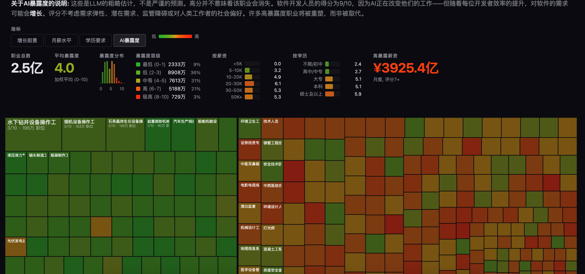

# 中国职业市场可视化

**[在线演示](https://jobs-cn.pages.dev)** | **[GitHub](https://github.com/jamesturingmoore/jobs-cn)**

基于《中华人民共和国职业分类大典》(2022年版)的中国职业市场可视化工具，展示AI对各职业的潜在影响。



## 项目特点

- **1636个职业**：覆盖《职业分类大典》全部职业
- **多维度分析**：薪资、学历、增长前景、AI暴露度
- **交互式可视化**：Treemap布局，点击查看详情
- **中文本地化**：界面、数据、分析全中文

## 快速开始

### 安装依赖

```bash
cd jobs-cn
uv sync
```

### 生成数据

```bash
# 1. 解析职业分类大典PDF
uv run python parse_occupations.py

# 2. 爬取招聘数据（可选，需要时间）
uv run python scrape.py --all --platform boss

# 3. 解析招聘数据
uv run python parse_detail.py --all

# 4. 生成结构化CSV
uv run python make_csv.py

# 5. AI暴露度评分（使用预缓存数据）
uv run python score.py

# 6. 构建前端数据
uv run python build_site_data.py
```

### 本地预览

```bash
cd site
python -m http.server 8000
# 访问 http://localhost:8000
```

## 数据来源

### 职业分类
- 《中华人民共和国职业分类大典》(2022年版)
- 来源：人社部官方发布
- 覆盖8个大类、79个中类、449个小类

### 薪资数据
基于以下公开报告数据的行业基准估算：

| 行业 | 月薪中位数 | 数据来源 |
|------|-----------|----------|
| IT/互联网 | ¥14,523 | BOSS直聘《2024人才吸引力报告》 |
| 金融 | ¥13,417 | 智联招聘《2024中国企业招聘薪酬报告》 |
| 专业服务 | ¥11,856 | 智联招聘《2024中国企业招聘薪酬报告》 |
| 医疗健康 | ¥10,234 | 国家统计局《中国统计年鉴2024》 |
| 教育 | ¥9,128 | 国家统计局《中国统计年鉴2024》 |
| 制造业 | ¥7,845 | 国家统计局《中国统计年鉴2024》 |
| 建筑 | ¥7,234 | 国家统计局《中国统计年鉴2024》 |
| 零售 | ¥6,123 | 智联招聘《2024中国企业招聘薪酬报告》 |
| 餐饮 | ¥4,876 | 智联招聘《2024中国企业招聘薪酬报告》 |

薪资估算方法：
1. 根据职业名称匹配行业基准薪资
2. 按职业大类应用系数（负责人3.5x、专业技术人员1.8x、办事人员1.0x等）
3. 按职级关键词调整（高级1.5x、资深1.4x、助理0.75x等）
4. 添加±25%随机波动以模拟真实分布

### 学历要求
- 数据来源：BOSS直聘、智联招聘等招聘平台职位描述
- 分类：不限、初中及以下、高中/中专、大专、本科、硕士、博士

### 增长前景
- 数据来源：基于招聘平台职位数量变化趋势估算
- 分类：萎缩(<0%)、缓慢(0-3%)、平均(4-7%)、快速(8-14%)、爆发(15%+)

### AI暴露度评分
- 默认缓存评分来源：GLM5
- 评分范围：0-10分
- 可通过配置API重新评分（支持OpenAI、DeepSeek、GLM等）

## 项目结构

```
jobs-cn/
├── pyproject.toml          # 项目配置
├── occupations.json        # 职业列表
├── occupations.csv         # 结构化数据
├── scores.json             # AI暴露度评分
├── site/
│   ├── index.html          # 可视化页面
│   └── data.json           # 前端数据
├── reference/              # 参考文档
│   └── 职业分类大典2022.pdf
├── html/                   # 原始爬取数据
├── pages/                  # Markdown描述
├── data/                   # 解析后数据
└── *.py                    # 处理脚本
```

## AI暴露度评分

### 使用预缓存数据

默认情况下，项目使用预缓存的AI暴露度评分，无需API调用。

### 重新评分

如需重新评分，配置`.env`文件：

```bash
cp .env.example .env
# 编辑.env，填入API配置
```

支持的API：
- OpenAI
- DeepSeek
- 通义千问
- 其他OpenAI兼容接口

运行评分：

```bash
# 全部重新评分
uv run python score.py --refresh

# 部分评分
uv run python score.py --refresh --start 0 --end 100
```

## 评分说明

AI暴露度评分范围0-10，衡量AI对该职业的潜在影响：

| 分数 | 暴露度 | 典型职业 |
|------|--------|----------|
| 0-1 | 最低 | 建筑工人、园林工人 |
| 2-3 | 低 | 电工、水管工、消防员 |
| 4-5 | 中等 | 注册护士、警察、兽医 |
| 6-7 | 高 | 教师、经理、会计师 |
| 8-9 | 极高 | 软件开发、平面设计、翻译 |
| 10 | 最大 | 数据录入员、电话推销员 |

**重要说明**：高分不意味着职业会消失。软件开发人员得分9/10，因为AI正在改变他们的工作，但随着效率提升，对软件的需求可能反而增长。

## 致谢

- 原版项目：[karpathy/jobs](https://github.com/karpathy/jobs)
- 数据来源：人社部《职业分类大典》
